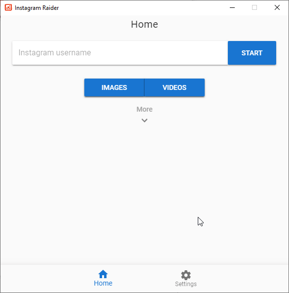

#  Instagram Raider
> An Instagram downloader desktop application

Instagram Raider allows you to easily download Instagram images and videos.



## Installation

[Download the latest version](https://github.com/Mintonne/instagram-raider/releases/latest) from the releases page.

## Development

Built with [Electron](https://electronjs.org) and [Vue.js](https://vuejs.org/)

#### Run

```
$ npm install
$ npm run electron:serve
```

#### Lint

```
$ npm run lint
```

#### Build

```
$ npm run electron:build
```

More information [here](https://nklayman.github.io/vue-cli-plugin-electron-builder/)

#### Contributing

1. Fork it (<https://github.com/yourname/yourproject/fork>)
2. Create your feature branch (`git checkout -b feature/fooBar`)
3. Commit your changes (`git commit -am 'Add some fooBar'`)
4. Push to the branch (`git push origin feature/fooBar`)
5. Create a new Pull Request

## Credits

- Icon made by [Alex Prunici](https://www.iconfinder.com/AlexAPR)
